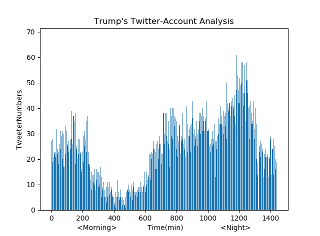
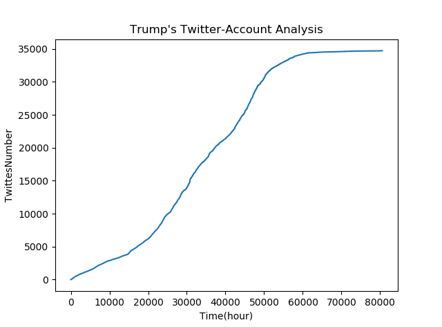
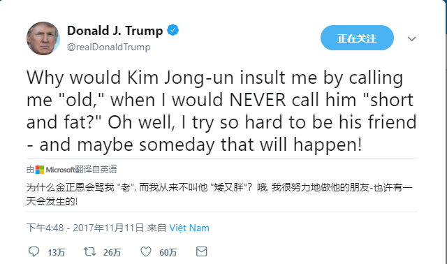
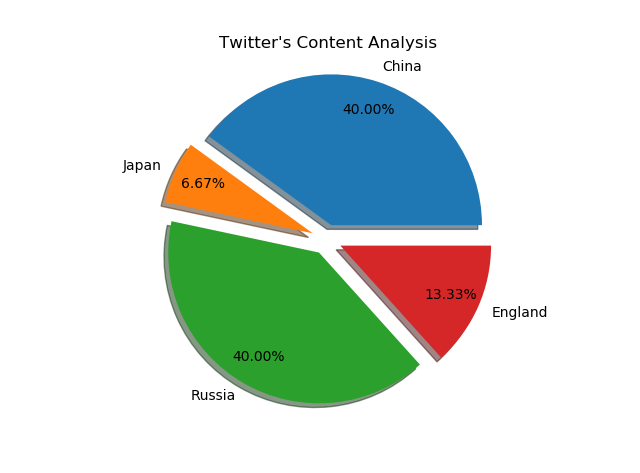
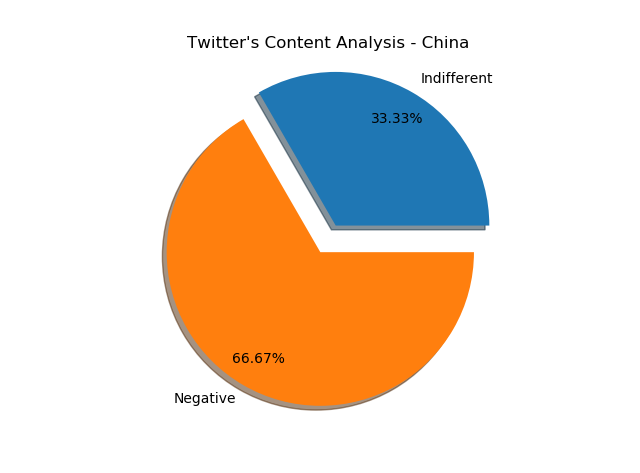
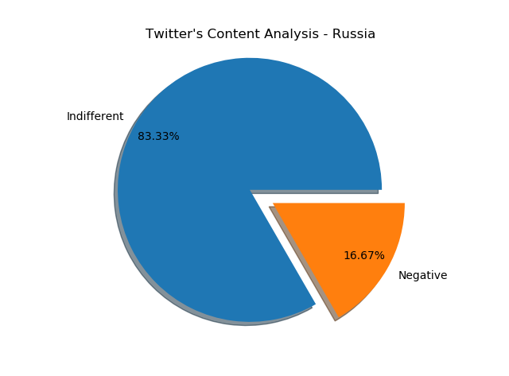
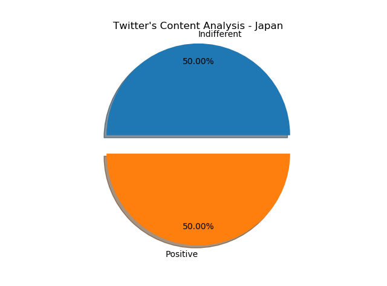
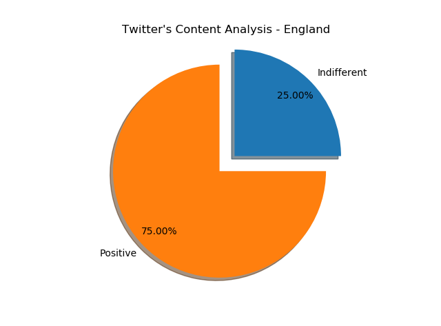

# TrumpTwitterAnalysis
## 推特数量、发送时间分析

### 每日发推时间分析
可以看出特朗普每日发推时间段集中在午夜之后和19：00到20：00之间

 

### 发推的增速
中后期增速变大

 

### 最高喜欢
<video style="width:100%" controls>
  <source src="./img/FraudNewsCNN FNN.mp4" type="video/mp4">
Your browser does not support the video tag.
</video>
 

### 最高转发

 

### 评论中提及各国的次数

 

#### 评论中对中国的态度

 
关键字：批评了奥巴马、布什对中国政策，声明中国在非洲的军事威胁，抵制中国货
 

#### 评论中对俄罗斯态度

 
关键字：双边关系、间谍事件、Russia and the world has already started to respect us again!
 

#### 评论中对日本态度

 
关键字：共建更好的军事、新PPP协定
 

#### 评论中对英国态度

 
关键字：欢迎光临白宫、超级碗、英国新闻
 
